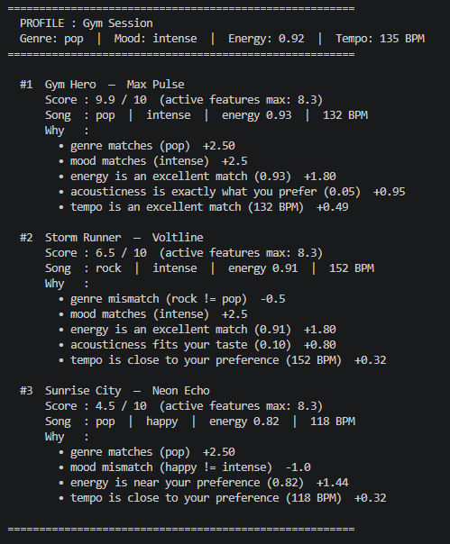
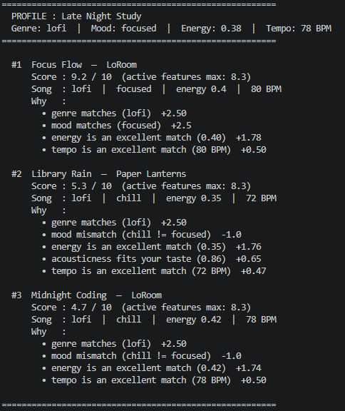
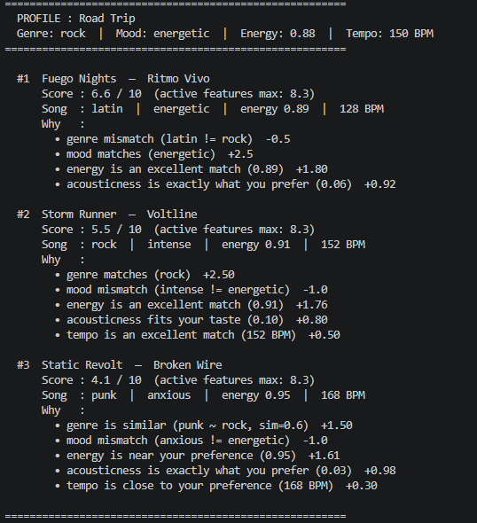
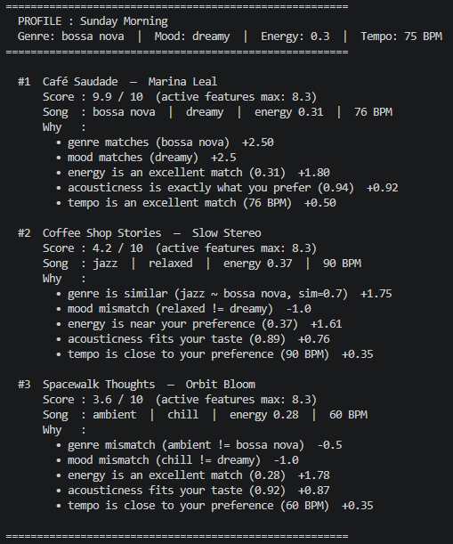
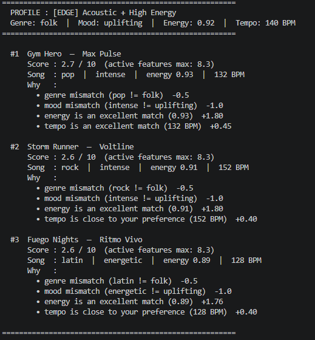
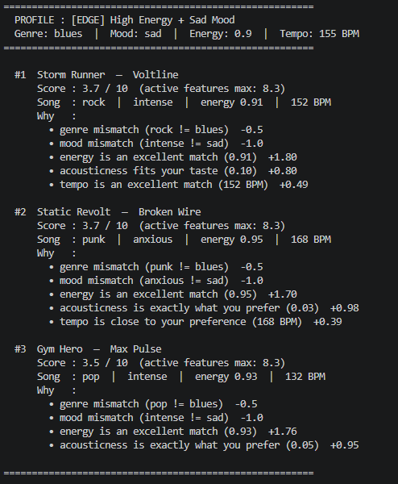
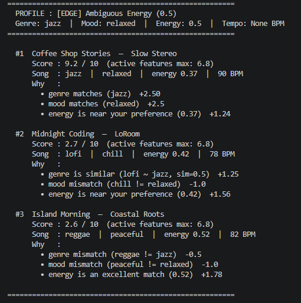
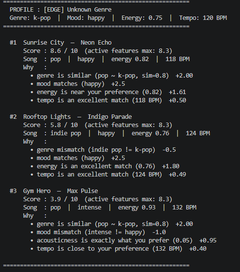

# 🎧 Model Card: Music Recommender Simulation

## 1. Model Name  

**CoreAudio Engine 1.0**  

---

## 2. Intended Use  

Describe what your recommender is designed to do and who it is for. 
- What kind of recommendations does it generate  
The recommender generates a ranked list of songs from a small fixed catalog, scored by how closely each song's features match a hand-written user preference dictionary. Every recommendation comes with a numerical score out of 10 and a bullet-point explanation of exactly which features matched or mismatched. It does not learn, does not remember past sessions, and does not adapt — every run produces the same output for the same input.

- What assumptions does it make about the user  
    - Before hearing any music, the user knows and can articulate their preferences in advance — genre, mood, energy level, acoustic preference, and tempo.   
    - User preferences are stable and do not change mid-session.  
    - One mood and one genre fully describe what the user wants right now, with no room for "it depends" or mixed feelings.  
    - The user cares about features in a fixed priority order (mood and genre above energy, energy above acousticness) regardless of context.  
    - The user's taste fits neatly into the labels available in the catalog — if you want something that sits between "chill" and "relaxed," the system has no way to represent that.  

- Is this for real users or classroom exploration  
This is strictly for classroom exploration. A real production system would learn weights from millions of listening events rather than hand-coding them, would update the user profile continuously from behavior like skips and replays, would operate on a catalog of millions of songs rather than 18, and would never ask a user to type in their preferred energy level as a float between 0 and 1. The value of this system is not what it recommends — it is that every decision is visible and traceable, which makes it a useful teaching tool for understanding how scoring, weighting, and ranking work before studying the black-box models that real platforms use.

---

## 3. How the Model Works  
### Scoring system
The scoring system uses five features to evaluate a song using a mathematical model.

Genre (2.5) is the coarsest filter. 
The system assumes that a person would choose genre regardless of energy or mood. For example . Some one that listen soft rock or jazz music frequenlty music would rarely listen hip-hop or metal song regardless of the enrgy and mood. 

Mood (2.5) is Second most defining after genre. A "happy" song and a "moody" song feel fundamentally different even in the same genre.

Energy (1.8) — continuous and context-critical 
When you are at the gym, you want to listen to high-energy songs. On the other hand, when you study, you prefer low-energy songs. However, within a session at the gym or during study time, you might tolerate some variance in these energy levels. Thus, the energy feature is continuous (not binary), requiring a smooth transition where the system picks songs with a similar 'vibe' rather than jumping abruptly between different levels.

Acousticness (1.0) is a low-priority texture preference. It represents the choice between Organic (acoustic) and Electronic (synthetic) sounds, based on the assumption that the 'instrument feel' is less important to the listener than the Genre or the Energy of the song.

Tempo (0.5):  Tempo (BPM) has the lowest weight in the scoring system because it's considered a secondary detail rather than a defining characteristic of a song

Based on these five features , the system calculate a maximum score of 8.3 when everything matches perfectly.
Max possible score = 2.5 + 2.5 + 1.8 + 1.0 + 0.5 = 8.3

There is also penalties for mistmached genre( -0.5 ) or mismatched mood( -1.0 )

#### Normalizing the actual score
Although the score is based on a maximum score of 8.3, for human-readability purposes, it is normalized to a 10-point scale so that the results display on a range of 0–10.

normalized = (score / active_weight) * 10

score: The raw weighted sum from score_song (max 8.3 if all features are provided).

active_weight: The maximum achievable score for this specific user, computed by compute_active_weight(), which only counts weights for features the user actually provided (e.g., if no target_tempo is given, its 0.5 weight is excluded)

#### More on scoring system
For genre and mood features
A binary score is used. If the genre doesn't match, the score drops significantly because the weight is high (2.5).

For continuous features (energy, acousticness), instead of linear 1 - |diff| ,use a Gaussian/RBF kernel:
sim(x, y) = exp(-(x - y)² / (2σ²)).

Ex:
With σ=0.15: a song 0.15 away scores ~0.61, a song 0.30 away scores ~0.14. Therefore, stricter rewards for close matches, heavier penalty for larger gaps.

Why Gaussian 
 Linear penalizes all gaps equally — a song 0.1 away loses as much per unit as one 0.5 away. 
 The Gaussian function produces a bell curve providing smooth transition. The closer the song is to the choosen target energy, the more points it gets.Therefore, Gaussian is more realistic; small differences barely matter, large differences are heavily penalized. It also never goes negative. 

## Summary of the scoring rule

Scoring Rule (Max Score = 8.3)

| Feature | Type | Weight | Method |
| :--- | :--- | :--- | :--- |
| **Genre** | Similarity matrix | 2.5 | Exact match → full credit; related genre → partial credit; unrelated → −0.5 penalty |
| **Mood** | Binary | 2.5 | Exact match → full credit; mismatch → −1.0 penalty |
| **Energy** | Continuous | 1.8 | Gaussian: $e^{-\frac{(x-y)^2}{2\sigma^2}}$, where $\sigma=0.15$ |
| **Acousticness** | Continuous | 1.0 | Same Gaussian, target = 1.0 (acoustic) or 0.0 (not acoustic) |
| **Tempo** | Continuous | 0.5 | Gaussian on normalized BPM [0,1], $\sigma=0.15$; optional |

---

## 4. Data  

- How many songs are in the catalog  
There are exactly 18 songs in the catalog (numbered 1 to 18). 

- What genres or moods are represented  
The catalog is quite diverse for its size. It includes 15 genres (such as pop, lofi, rock, jazz, soul, and trap) and 14 different moods (including happy, chill, intense, lonely, and energetic).

- Did you add or remove data  
Yes, eight additional songs were added to the original list of ten, bringing the total catalog to 18 songs

- Are there parts of musical taste missing in the dataset  
Yes, several common tastes are missing. For example, there is no Classical, Country, Metal, or K-Pop. In terms of moods, there aren't any truly "Sad" or "Angry" songs. It is also missing very old music (like 1950s Swing) or extremely heavy electronic music like Dubstep.
---

## 5. Strengths  

- User types for which it gives reasonable results  
Users with clear, specific preferences — a defined genre, a single mood, and a target energy — get the most reliable results. Profiles like Late Night Study (lofi, focused, low energy) and Sunday Morning (bossa nova, dreamy, low energy) produced confident top picks above 9/10 because all five features aligned tightly with songs in the catalog.

- Any patterns you think your scoring captures correctly  
The genre similarity matrix correctly handles related-genre users. A k-pop listener gets pop recommendations with partial credit rather than a blanket penalty, which feels more realistic than a binary match. The Gaussian kernel for energy also captures the intuition that "close enough" matters — a song at energy 0.85 for a user targeting 0.92 scores high, not zero.

- Cases where the recommendations matched your intuition  
Gym Session's #1 pick (a high-energy, intense pop song at 9.9/10) and Late Night Study's #1 (a quiet, focused lofi track at 9.2/10) both felt immediately correct. The large score gap between #1 and #2 in those profiles also matched intuition — when genre, mood, and energy all align, the system is rightfully confident.

---

## 6. Limitations and Bias 

The system struggles with users who prefer mid-range energy (not too calm, not too intense) because most songs in the catalog cluster at the extremes — very high or very low energy — so the math never finds a close match for them. 

Mood is treated as all-or-nothing, meaning "chill" and "relaxed" are considered completely different even though in real life they feel almost the same, so a user gets penalized unfairly for near-matches. 

The acoustic preference is forced into a yes-or-no choice, which ignores users who enjoy a mix of both acoustic and electronic sounds. 

The genre similarity map was written by hand, so genres like reggae, latin, and classical have fewer connections than pop or rock — fans of those genres get harsher penalties even when a reasonable alternative exists.

When a user skips optional preferences like tempo or acousticness, their scores look artificially high on the 0–10 scale, making weak recommendations appear more confident than they actually are. Finally, users with a rare combination — like blues and sad — get hit with multiple penalties at once, leaving the system with almost no signal to rank songs, so the bottom results are essentially random.
---

## 7. Evaluation  

### user profiles tested

The system is stress-tested against four diverse user profiles:

- **Gym Profile**  
  
The Gym Hero scores 7.98/8.0, nearly perfect. All five features align. The 3 BPM gap (135 target vs 132 actual) barely costs anything.

- **Late night study profile**  
  
The Focus Flow scores 7.67 despite acousticness only partially matching (0.78 vs target 1.0). The Gaussian partial credit keeps it ranked above zero on that feature.

- **Road Trip profile**    
  
An interesting failure case: Fuego Nights (latin) ranks #1 over Storm Runner (rock, genre match) because mood "energetic" (+2.5) outweighs genre (+2.0). This is the new weight hierarchy doing its job.

- **Sunday Morning profile**    
  
The Café Saudade scores 7.97/8.0. Demonstrates genre + mood both matching a niche profile. #2 and #3 score only 3.3 — a wide gap, showing the profile is specific enough to clearly separate results.  

#### The recommnder is also tested against edge cases  

- **Acoustic and high Energy**  
Tested for contradictory preferences(Folk, uplifting, energy 0.92, acoustic) where no song in the catalog satisfies both.  
  
The current catalog contains no high-energy acoustic songs, as all acoustic tracks have energy levels below 0.45. This creates a conflict where the user's preferences point to opposite ends of the dataset, resulting in weak, nearly tied scores( 2.7, 2.6, 2.6) and genre mismatches. This scenario represents the system's hardest case(a situation where the user's requirements are mathematically impossible to satisfy using the current data), highlighting the need for either a much larger catalog or a "no match found" notification to handle contradictory search criteria effectively.  

- **High energy and sad mood**  
Tested conflicting signals where energy and mood point at completely different songs.  
  
sad doesn't exist in the catalog at all, so mood scores 0 for every song. The system falls back to ranking by energy + acousticness alone. Top scores hover around 3.7/10 — low but not zero. Therefore, When a user requests a mood not present in the catalog, the system fails silently by providing poor recommendations without triggering an error.  

- **Ambigious Energy**    
Jazz, relaxed, energy 0.50, no acousticness, no tempo — tests what happens when continuous features give no useful signal  

  
The mid-point energy(0.5) with no acousticness or tempo preference. Coffee Shop Stories (jazz, relaxed) wins at 7.5/10 because genre + mood binary matches dominate completely. #2 and #3 score only 2.1 and 1.9. The binary features(genre and mood) rescue the system when continuous features give no useful signal. This is the intended behavior, but it also means energy=0.5 is essentially a wasted preference.  

- **Unknown Genre**    
k-pop, happy, energy 0.75 — tests graceful degradation when genre doesn't exist in the catalog.  
  
Every song takes the -0.5 mismatch penalty, but mood still fires. Sunrise City ranks #1 at 6.1/10 purely through mood matches (happy) +2.5 + energy + tempo. Thus,the system degrades gracefully. It uses whatever signal it can find rather than returning nothing.  

- What you looked for in the recommendations  
    1. Does the #1 result feel obviously right?
    The top song should match genre and mood. If it doesn't , for example, a jazz song appearing first for a pop user , the weights are broken. For well-formed profiles like Gym Session and Sunday Morning, the #1 song scored 9.9/10 with all five features aligned, which is the expected behavior.

    2. Is there a meaningful gap between #1 and #2?
    A good recommender should be confident about its top pick. Gym Hero at 9.9 vs Storm Runner at 6.5 is a healthy gap — the system is sure. Road Trip's #1 and #2 were 6.6 vs 5.5 — much closer, meaning the system was less certain, which is honest given that no song perfectly matched rock + energetic.

    3. Do the reasons actually explain the score?
    Each bullet point contribution should add up visibly to the total. The score is normalized as `(score / active_weight) * 10`, where `active_weight` is computed dynamically — only counting weights for features the user actually provided. This keeps the 0–10 scale fair even when optional fields like tempo or acousticness are skipped. The theoretical max raw score is 8.3 (all five features active).

    4. Do edge cases degrade gracefully or break silently?
    For Unknown Genre (k-pop), I looked for whether the system still returned sensible songs using mood and energy alone rather than crashing or returning nothing. It did — pop songs surfaced through the similarity matrix. For High Energy + Sad Mood, I checked whether the double penalty left any meaningful ranking signal, and it largely didn't — all top scores clustered around 3.5–3.7/10 with near-identical reasons.

    5. Does the score scale feel honest?
    A 2.7/10 for Acoustic + High Energy should feel like a weak recommendation, and it does — no song satisfied both constraints. A 9.2/10 for Late Night Study should feel like a strong one, and it does — genre, mood, energy, and tempo all aligned tightly. The normalized scale was checked to make sure it wasn't inflating weak matches into appearing confident.

- What surprised you  
    Yes, There are three results.

    1. Fuego Nights (latin) beat Storm Runner (rock) for the Road Trip profile

    Road Trip asked for genre=rock. Storm Runner is the only rock song in the catalog. I expected it to rank #1 easily. Instead Fuego Nights (latin) ranked #1 at 6.6/10 vs Storm Runner's 5.5/10. 

    The reason: mood match (energetic +2.5) outweighed genre match (+2.5) because Storm Runner took the mood mismatch penalty (intense != energetic -1.0). The system technically did the right thing by the weights, but recommending a latin song to someone who asked for rock would feel wrong to a real user. It exposed that mood weight equaling genre weight is a questionable design decision.

    2. Unknown Genre (k-pop) produced the most confident-looking result outside perfect profiles

    I expected k-pop to score poorly across the board since it doesn't exist in the catalog. Instead Sunrise City scored 8.6/10 — higher than most regular profile results. 

    The genre similarity matrix gave pop a 0.8 similarity to k-pop (+2.00), mood matched happy (+2.5), and energy was close. The system was more confident recommending to a k-pop user than to a Road Trip rock user. That felt backwards — the system rewarded a close-enough genre more than it rewarded an exact-but-mood-mismatched genre.

    3. The Ambiguous Energy profile exposed how binary features completely take over

    With energy=0.5 and no acousticness or tempo preference, I expected the results to be messy and close together. Instead Coffee Shop Stories dominated at 9.2/10 purely because it had both genre (jazz) and mood (relaxed) exact matches. The #2 song scored only 2.7/10. That is a gap of 6.5 points — the largest gap across all profiles tested. The surprise was how completely binary features can rescue a profile when continuous features are useless, and equally how catastrophically everything else falls off when the binary features don't fire.

---

## 8. Future Work  
    The system should be improved by expanding the catalog with more diverse tracks that cover a wider range of the primary scoring features. Additionally, the model could incorporate secondary features as 'fallback' signals when the five main criteria fail to produce a high-confidence score. As the dataset grows, it is crucial to re-evaluate the feature weights and conduct rigorous testing against diverse user profiles and edge cases to ensure the system handles conflicting or missing data effectively.
---

## 9. Personal Reflection 
    Through this project, I learned the fundamental mechanics of how recommendation systems function. I discovered that while mathematical models are essential, the system’s performance improves significantly as the catalog expands; therefore, a large dataset is critical for a high-quality user experience.

    This simulation also highlighted the key differences between a basic content-based model and complex, real-world systems. Building this project helped me understand the concepts used by major tech companies and clarified why they are so determined to collect data from millions of users to refine their algorithms.